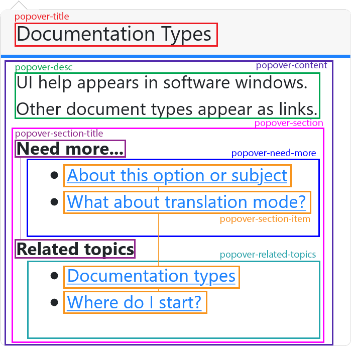

## edc-popover-react [](https://travis-ci.org/tech-advantage/edc-popover-react)
This is a react implementation of edc popover displaying the contextual help

_This project is meant to be used with **easy doc contents** (aka edc)._

edc is a simple yet powerful tool for agile-like documentation
management.

Learn more at [https://www.easydoccontents.com](https://www.easydoccontents.com).

## Dependencies

The required dependencies are:

- [ReactJS](https://reactjs.org/) 16.4.0 or higher
- [FontAwesome](https://github.com/FortAwesome/Font-Awesome) 5.13.0 or higher
- [bootstrap](https://getbootstrap.com/) 4.5.0 or higher
- [edc-client-js](https://github.com/tech-advantage/edc-client-js) 3.0.1 or higher
- [react-bootstrap](https://react-bootstrap.github.io/) 1.0.1 or higher

## How to use

### Import

You can import this module with `npm` by running:
```bash
npm install edc-popover-react --save
```

Or with `yarn`:
```bash
yarn add edc-popover-react
```

### Setup

To work properly, this module needs a basic configuration, you must implement your own configuration by using a high-level Component `PopoverConfigProvider` like the example below:
```typescript jsx
import { PopoverProvider } from 'edc-popover-react'
import { EdcHelp } from 'edc-popover-react'
...

<PopoverProvider
        pluginId='myedchelp'
        docPath='/doc'
        helpPath='/help'
        i18nPath='/doc/i18n'
      >
    ...
   <EdcHelp .../>
    ...
   <EdcHelp .../>
    ...
</PopoverProvider>
```

Props to specify for the `PopoverProvider` :
| Prop | Type | Description |
|---|---|---|
| pluginId | `string` | The identifier of the target plugin documentation export |
| helpPath | `string` | The path to edc-help-ng application |
| docPath  | `string` | The path to exported documentation |
| i18nPath | `string` | The path to translation json files |

Optional prop that can be overridden :
| Method | Return type | Description | Default value |
|---|---|---|---|
| icon | `EdcIconData` | The icon (see [Icons](#Icons)) | `far fa-question-circle` |
| lang | `string` | The default language | `en` |
| dark | `boolean` | true if dark mode enabled | `false` |
| placement | `Placement` | The popover placement | `auto` |
| trigger | `OverlayTriggerType \| OverlayTriggerType[]` | The trigger type | `click` |
| failBehavior | `FailBehavior` | The popover's behavior when an error occurs (see [Behavior](#Fail-behavior)) | `{ popover: 'FRIENDLY_MSG', icon: 'SHOWN' }` |

You can also reuse your provider to make your app more flexible (but not recommended) :
```typescript jsx
render(){
  return (
  ...
  <PopoverProvider
          pluginId='myedchelp'
          docPath='/doc'
          helpPath='/help'
          i18nPath='/doc/i18n'
        >
    ...
    <EdcHelp .../>
    ...
    <EdcHelp .../>
    ...
  </PopoverProvider>
  ...
  <PopoverProvider
          pluginId='myedchelp'
          docPath='/doc'
          helpPath='/help'
          i18nPath='/doc/i18n'
          icon='far corst'
        >
    ...
    <EdcHelp .../>
    ...
  </PopoverProvider>
  ...
  )
}
```

### Usage

The main component is `EdcHelp`, you can use the component as follows:
```typescript jsx
import { EdcHelp } from 'edc-popover-react'

...
<EdcHelp mainKey='myKey' subKey='mySubKey'/>
...
```

All EdcHelp props that override the Provider are in the EdcHelp scope and completely isolated.

You can safely use several languages without modifying the provider !

Props to specify for the `EdcHelp` :
| Prop | Type | Description |
|---|---|---|
| mainKey | `string` | The main key of the contextual help |
| subKey | `string` | The sub key of the contextual help |

Optional prop that can be overridden :
| Method | Return type | Description | Default value |
|---|---|---|---|
| pluginId | `string` | A custom pluginId | `undefined` (keeps the pluginId from the provider) |
| dark | `boolean` | true if dark mode enabled | `false` |
| lang | `string` | A language | `undefined` (keeps the language from the provider) |
| trigger | `OverlayTriggerType \| OverlayTriggerType[]` | A trigger | `click` |
| icon | `EdcIconData` | An icon (see [Icons](#Icons)) | `undefined` (keeps the icon from the provider) |

**:warning: All `EdcHelp` components must be surrounded by your configured provider** (see [Setup](#Setup))

## Customization

### Fail behavior

You can customize the popover's behavior when an error occurs with the `FailBehavior` object.

There are separate behaviors for the help icon, and the popover itself.
For the help icon when an error occurs:
 - `SHOWN` The help icon is shown as usual
 - `DISABLED` The help icon is greyed out
 - `HIDDEN` The help icon is completely hidden (but stays in DOM to avoid breaking the UI)
 - `ERROR` The help icon is replaced by an exclamation point (`fas fa-exclamation-circle`)

For the popover when an error occurs:
 - `ERROR_SHOWN` An error message is shown in the popover
 - `FRIENDLY_MSG` A friendly and translated message is shown in the popover
 - `NO_POPOVER` No popover appears when the help icon is triggered

By default, the icon is `SHOWN` and the popover is set to `FRIENDLY_MSG`.

**:warning: In case of a missing provider error, an error is always shown !**

### Icons

The popover icons support 2 formats:
 - A CSS class (Font Awesome, Glyphicon, ...) using a `<i />`
 - An image which will have the same size as the text (height: 1em;) (PNG, JPG, SVG, ...) using a ``

You can choose with the `type` prop:
 - `class`: The `content` must represent the CSS class
 - `url`: The `content` must represent the image's URL

If a `string` is provided to an EdcIconData, it will be interpreted as a CSS class by default.

### CSS

#### Popover

You can customize the popover's design with CSS classes as below:



#### Help icon

Each behavior (see [Fail behavior](#Fail-behavior)) can be customized as below:

| Behavior | CSS selector |
|---|---|
| `SHOWN` | `.help-icon` |
| `DISABLED` | `.help-icon-disabled` |
| `HIDDEN` | `.help-icon-hidden` |
| `ERROR` | `.help-icon-error` |

(You can see the default values [here](./src/components/EdcHelp.scss))

## Tests

### Unit

edc-popover-react uses [Jest](https://jestjs.io/) and [Enzyme](https://enzymejs.github.io/enzyme/) for unit testing, you can test it by running:
```bash
npm test
```
or
```bash
yarn test
```
### UI components

edc-popover-react uses [Storybook](https://storybook.js.org/) for isolated UI components and features testing, you can test it by running:
```bash
npm run storybook
```
or
```bash
yarn run storybook
```

